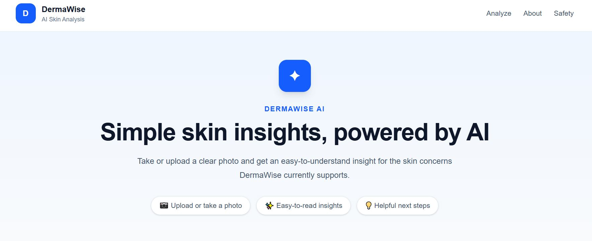
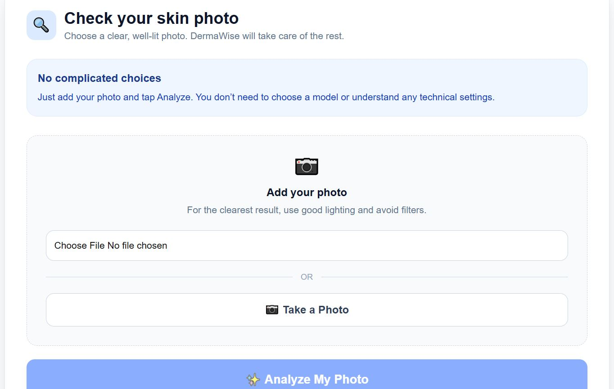
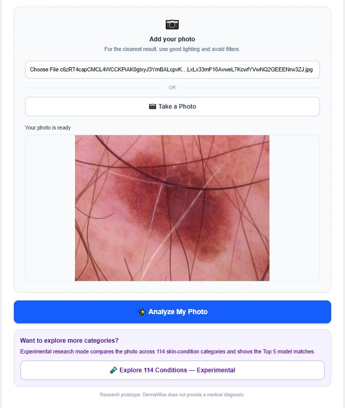
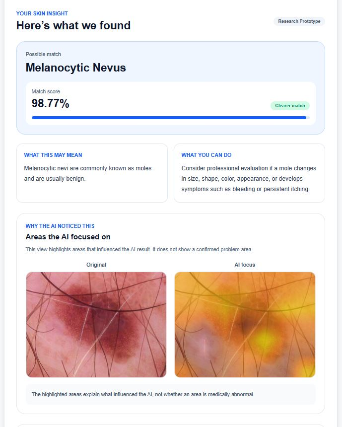

# DermaWise AI

## AI-Assisted Dermatology Platform for Skin-Condition Analysis

DermaWise is a research-oriented AI-assisted dermatology platform designed to analyze skin images using multiple deep-learning models rather than relying on a single universal classifier.

The project combines skin-lesion classification, common skin-condition analysis, experimental broad dermatology classification, uncertainty handling, image-quality validation, explainable AI using Grad-CAM, external subgroup evaluation, knowledge distillation, and TensorFlow Lite conversion for edge-deployment research.

> **Important:** DermaWise is an academic research prototype. It is not a medical device and must not be used as a substitute for professional diagnosis or treatment.

---
---

## Application Preview

### DermaWise Interface



### AI-Assisted Skin Analysis



### Grad-CAM Explainability



### Experimental 114-Condition Analysis



---
## Project Objectives

DermaWise was developed to explore how AI can support dermatologic image analysis while explicitly accounting for uncertainty, interpretability, model efficiency, and generalization limitations.

The system aims to:

- Analyze multiple categories of dermatologic images
- Use specialized models for different analysis tasks
- Avoid forcing unsupported images into a diagnosis
- Provide model scores transparently
- Perform basic image-quality validation
- Visualize model attention using Grad-CAM
- Provide educational rather than diagnostic guidance
- Evaluate external performance across Fitzpatrick skin-type groups
- Explore knowledge distillation for model compression
- Demonstrate TensorFlow Lite edge-deployment readiness

---

# System Overview

DermaWise currently contains three AI classification modules:

| Module | Classes | Model | Status |
|---|---:|---|---|
| Skin Lesion Classifier | 7 | EfficientNetB0 | Primary |
| Common Skin Classifier | 4 | EfficientNetB0 | Primary |
| Broad Dermatology Classifier | 114 | MobileNetV3Small KD Student | Experimental |

The primary workflow uses the two specialist models with conservative uncertainty handling.

The 114-condition classifier is intentionally exposed as a separate experimental research module because its current performance is not sufficient for dependable user-facing diagnosis.

---

# 1. Skin Lesion Classification

The lesion classifier was developed using the HAM10000 dataset.

## Supported Lesion Classes

| Code | Category |
|---|---|
| akiec | Actinic Keratosis |
| bcc | Basal Cell Carcinoma |
| bkl | Benign Keratosis |
| df | Dermatofibroma |
| mel | Melanoma |
| nv | Melanocytic Nevus |
| vasc | Vascular Lesion |

## Dataset

HAM10000 contains:

- **10,015 images**
- **7 lesion categories**

A `lesion_id` group-aware train/validation/test strategy was used so that images belonging to the same lesion did not appear across different splits.

This reduces the risk of data leakage.

## Architecture

- EfficientNetB0
- ImageNet pretrained weights
- 224 × 224 RGB input
- Data augmentation
- Global Average Pooling
- Dropout
- Seven-class softmax output
- Class weighting
- Fine-tuning of upper backbone layers

## Held-Out Test Performance

| Metric | Result |
|---|---:|
| Accuracy | **71.67%** |
| Macro F1 | **0.5274** |
| Macro Recall | **57.38%** |
| Weighted F1 | **0.7342** |

Performance varies substantially by class because of dataset imbalance and differences in class difficulty.

---

# 2. Common Skin-Condition Classification

A separate model was developed for common skin-condition analysis using selected cases from the Google SCIN dataset.

## Supported Classes

- Acne
- Eczema
- Folliculitis
- Psoriasis

The model was trained independently from the HAM10000 lesion classifier.

## Data Preparation

The prepared dataset contained:

- **1,244 unique valid images**
- **589 cases**
- Case-aware train/validation/test separation
- No case overlap between the dataset splits

Split sizes:

| Split | Images |
|---|---:|
| Training | 863 |
| Validation | 191 |
| Test | 190 |

## Architecture

- EfficientNetB0
- ImageNet pretrained weights
- 224 × 224 RGB input
- Image augmentation
- Global Average Pooling
- Dropout
- Four-class softmax output

## Held-Out Test Performance

| Metric | Result |
|---|---:|
| Accuracy | **66.32%** |
| Macro F1 | **49.52%** |
| Weighted F1 | **65.93%** |

### Per-Class Results

| Class | Precision | Recall | F1 |
|---|---:|---:|---:|
| Acne | 50.00% | 90.00% | 64.29% |
| Eczema | 80.77% | 78.95% | 79.85% |
| Folliculitis | 37.50% | 20.69% | 26.67% |
| Psoriasis | 23.08% | 33.33% | 27.27% |

These results demonstrate that overall accuracy alone does not represent performance equally across all conditions.

---

# Conservative Multi-Model Routing

The primary DermaWise analysis workflow evaluates the lesion and common-skin specialist models.

A prototype score threshold of **60%** is used as a conservative routing heuristic.

The system follows this rule:

```text
Lesion model >= 60% AND Common model < 60%
        |
        +----> Lesion result

Common model >= 60% AND Lesion model < 60%
        |
        +----> Common-skin result

Both >= 60%
        |
        +----> Uncertain

Neither >= 60%
        |
        +----> Uncertain
```

The system deliberately does **not** directly compare the softmax scores of the independently trained models as though they were calibrated probabilities.

The 60% threshold is heuristic and has not been clinically calibrated.

An unsupported or ambiguous image can therefore produce an **Uncertain** result instead of being forced into one of the trained categories.

---

# 3. Experimental 114-Condition Research Module

DermaWise also includes a broader dermatology research module developed using the corrected Fitzpatrick17k-C classification dataset.

The dataset contains **114 dermatologic condition categories**.

This module is separate from the primary specialist-model workflow.

## Hierarchical Teacher Model

The strongest broad teacher experiment used an EfficientNetB2-based hierarchical architecture.

Held-out test results:

| Metric | Result |
|---|---:|
| Top-1 Accuracy | **30.44%** |
| Top-3 Accuracy | **49.30%** |
| Top-5 Accuracy | **57.89%** |
| Macro F1 | **0.2784** |
| Weighted F1 | **0.2882** |
| Macro Recall | **0.2785** |

Because 114-class dermatology classification is substantially more difficult and performance remains limited, this module is clearly presented as **experimental**.

The web interface displays the model's **Top-5 predictions** rather than presenting the highest-scoring class as a confirmed diagnosis.

---

# Knowledge Distillation

Knowledge distillation was explored to reduce the computational requirements of the broad 114-condition classifier.

## Teacher

- EfficientNetB2-based hierarchical model

## Student

- MobileNetV3Small
- 260 × 260 input
- Approximately **1.0 million parameters**

The student contains approximately **87.3% fewer parameters** than the teacher configuration used in the experiment.

Knowledge-distillation training used:

- Temperature: **3**
- Distillation weighting (`alpha`): **0.5**

## Student Test Performance

| Metric | Result |
|---|---:|
| Top-1 Accuracy | **31.67%** |
| Macro F1 | **0.2684** |
| Weighted F1 | **0.2923** |
| Macro Recall | **0.2758** |

These results demonstrate the project's exploration of model compression while retaining useful classification behavior.

---

# TensorFlow Lite / Edge AI

The knowledge-distilled MobileNetV3Small model was converted to **TensorFlow Lite Float16** format.

Approximate model sizes:

| Model Artifact | Size |
|---|---:|
| KD Student Keras Model | 4.37 MB |
| Float16 TFLite Model | 1.95 MB |

The converted TFLite model was verified against the Keras student using a real image.

Observed probability differences:

- Maximum probability difference: approximately **0.0044**
- Mean probability difference: approximately **0.00013**
- Top-1 predicted class remained unchanged

DermaWise therefore demonstrates **edge-deployment readiness**, but a native mobile application and physical-device latency benchmark have not yet been completed.

---

# Explainable AI — Grad-CAM

DermaWise integrates **Grad-CAM (Gradient-weighted Class Activation Mapping)** for the primary specialist models.

Grad-CAM visualizes image regions that influenced the neural network's prediction.

It is used for model interpretability rather than medical localization.

> A highlighted region does not prove that the region is medically abnormal or that the model's prediction is correct.

Grad-CAM quality can also vary depending on the model and image.

---

# Image Quality Validation

Before primary inference, the backend performs basic image checks including:

- Image decoding/validation
- Brightness checking
- Severe blur detection

These safeguards are heuristic.

They are intended to reject clearly unsuitable input rather than provide comprehensive photographic quality assessment.

---

# Uncertainty Handling

DermaWise avoids treating every neural-network output as a reliable diagnosis.

When the specialist routing criteria are not satisfied, the application returns:

**Uncertain**

instead of forcing the image into a supported condition.

Model scores are softmax outputs and must **not** be interpreted as calibrated clinical probabilities.

---

# Fitzpatrick17k External Subgroup Evaluation

The HAM10000 lesion classifier was additionally evaluated using a conservatively mapped subset of Fitzpatrick17k.

Initially, **1,324 metadata samples** were identified as compatible with selected lesion classes.

Because some external source images were unavailable, **363 images** were successfully obtained and evaluated.

## Available Images

| Class | Images |
|---|---:|
| Basal Cell Carcinoma | 253 |
| Melanoma | 79 |
| Actinic Keratosis | 23 |
| Dermatofibroma | 8 |
| **Total** | **363** |

## Performance by Fitzpatrick Skin Type

| Fitzpatrick Type | Images | Correct | Accuracy |
|---|---:|---:|---:|
| I | 29 | 10 | 34.48% |
| II | 89 | 24 | 26.97% |
| III | 110 | 26 | 23.64% |
| IV | 90 | 14 | 15.56% |
| V | 37 | 8 | 21.62% |
| VI | 8 | 2 | 25.00% |

External performance was substantially lower than internal HAM10000 performance.

These results should **not** be interpreted as definitive evidence of skin-tone bias because the evaluation has important limitations:

- Small subgroup sizes
- Only eight Fitzpatrick Type VI images
- Strong class imbalance
- Missing source images
- Only four directly mapped lesion classes
- Domain shift between datasets
- Differences between clinical photography and primarily dermatoscopic HAM10000 imagery

The experiment demonstrates the importance of external validation and highlights generalization and subgroup-performance limitations.

---

# Self-Supervised Learning Experiment

A SimCLR-style self-supervised learning pipeline was also implemented as part of the research exploration.

The experiment included:

- MobileNetV3Small encoder
- Data augmentation pipeline
- Projection head
- NT-Xent contrastive loss
- Temperature-based contrastive learning

The SSL pipeline was **implemented and sanity-tested**, but full SSL pretraining was not completed.

It is therefore presented as experimental work rather than a completed performance improvement.

---

# Application Architecture

```text
                         DERMAWISE
                             |
                  Image Upload / Camera
                             |
                             v
                    Image Quality Check
                             |
                             v
              +-----------------------------+
              |                             |
              v                             v
      Lesion Specialist             Common-Skin Specialist
       EfficientNetB0                  EfficientNetB0
         7 classes                       4 classes
              |                             |
              +-------------+---------------+
                            |
                            v
                  Conservative Router
                     60% heuristic
                            |
                  +---------+---------+
                  |                   |
               Result              Uncertain
                  |
                  v
              Grad-CAM
                  |
                  v
          Educational Guidance


       Separate Experimental Research Path
                       |
                       v
          114-Condition KD Student
             MobileNetV3Small
                       |
                       v
               Top-5 Predictions
                       |
                       v
          TensorFlow Lite / Edge
```

---

# Technology Stack

## Machine Learning

- Python
- TensorFlow
- Keras
- EfficientNetB0
- EfficientNetB2
- MobileNetV3Small
- NumPy
- OpenCV
- Pillow
- Scikit-learn

## Backend

- FastAPI
- Uvicorn

## Frontend

- Next.js
- React
- TypeScript
- Tailwind CSS

## Research / Development

- Google Colab
- Jupyter Notebook
- Visual Studio Code
- Git
- TensorFlow Lite

---

# Repository Structure

```text
DermaWise-AI/
│
├── Backend/
│   └── main.py
│
├── CommonSkinModel/
│   └── dermawise_common_skin_final.keras
│
├── Model/
│   ├── dermawise_grouped_finetuned_best.keras
│   └── Broad114/
│       ├── dermawise_kd_student_best.keras
│       ├── dermawise_kd_student_final_float16.tflite
│       └── fitzpatrick114_class_mapping.json
│
├── Notebook/
│   ├── DermaWise_Training_Evaluation.ipynb
│   ├── DermaWise_Common_Skin_Model.ipynb
│   └── DermaWise_114_Conditions.ipynb
│
├── frontend-app/
│   ├── app/
│   ├── public/
│   ├── package.json
│   └── package-lock.json
│
├── .gitignore
└── README.md
```

---

# Running DermaWise Locally

DermaWise requires both the FastAPI backend and Next.js frontend.

## Backend

From the project root:

```powershell
cd Backend
```

Create a Python virtual environment if one does not already exist:

```powershell
python -m venv venv
```

Activate it on Windows:

```powershell
.\venv\Scripts\Activate.ps1
```

Install the required Python dependencies using the project's dependency file.

Then start the API:

```powershell
uvicorn main:app --host 127.0.0.1 --port 8001
```

The backend will run at:

```text
http://127.0.0.1:8001
```

## Frontend

Open a second terminal:

```powershell
cd frontend-app
npm install
npm run dev
```

Then open:

```text
http://localhost:3000
```

---

# Current Features

- Image upload
- Camera capture
- Front/back camera switching where supported
- Image preview
- Invalid-image detection
- Basic image-quality validation
- Seven-class lesion classification
- Four-class common skin-condition classification
- Conservative multi-model routing
- Uncertain-result handling
- Model score display
- Grad-CAM visualization
- Educational information
- Safe next-step guidance
- Fitzpatrick17k external subgroup evaluation display
- Experimental 114-condition Top-5 classification
- Knowledge-distilled lightweight model
- Float16 TensorFlow Lite model
- Local inference support

---

# Important Limitations

1. DermaWise is not clinically validated.
2. It is not a medical diagnostic system.
3. Specialist models support only their explicitly trained classes.
4. Unsupported conditions may still produce neural-network scores.
5. The 60% routing threshold is heuristic rather than clinically calibrated.
6. Softmax scores are not clinical probabilities.
7. HAM10000 contains primarily dermatoscopic imagery, creating domain-shift concerns for ordinary phone photographs.
8. Common-skin performance varies substantially across classes.
9. The 114-condition classifier remains experimental.
10. Grad-CAM represents model attention, not medical correctness.
11. Image-quality checks are heuristic.
12. Fitzpatrick subgroup evaluation is small and imbalanced.
13. Native mobile deployment and physical-device benchmarking remain future work.
14. Prospective clinical validation has not been performed.

---

# Future Work

Potential extensions include:

- Improved out-of-distribution detection
- Probability calibration
- Improved uncertainty estimation
- Better Grad-CAM localization
- Larger and more diverse training datasets
- Improved minority-class performance
- More robust image-quality assessment
- Full self-supervised pretraining
- Native Android deployment
- Physical-device TFLite benchmarking
- Additional common skin-concern models
- Hair and scalp analysis
- Nail-condition analysis
- Broader external validation
- Clinically curated evaluation
- Prospective clinical validation
- Verified healthcare-professional integration with appropriate consent and safeguards

---

# Responsible Use

DermaWise is intended for **academic research, learning, and experimentation**.

It must not be used to:

- Confirm a medical diagnosis
- Rule out a disease
- Replace a dermatologist or other qualified healthcare professional
- Determine treatment
- Delay appropriate medical evaluation

Users with concerning, persistent, changing, painful, bleeding, or otherwise unusual skin findings should seek evaluation from an appropriately qualified healthcare professional.

---

## Project Status

**Research prototype — active development**

The current implementation demonstrates a multi-model AI-assisted dermatology architecture incorporating classification, uncertainty handling, explainability, external evaluation, model compression, and edge-AI preparation.